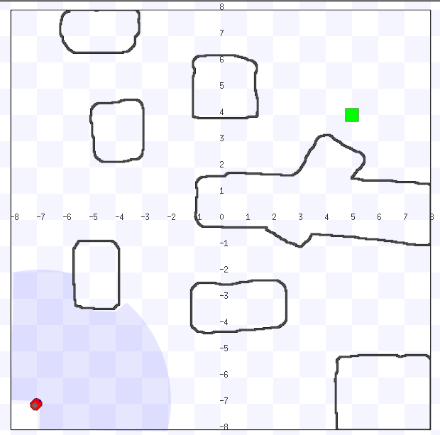

# Stage Challenge

This challenge is meant to introduce some basic ROS concepts to new users, however it assumes you’re familiar with fundamental ROS concepts, including creating and building packages and running nodes.

The task is to develop a ROS node to control a differential robot. The node must be capable of guiding the robot from the origin (x=-7.0, y=-7.0) to the target coordinates (x=4.5, y=4.0) while avoiding obstacles. The minimum distance error from the robot to the target in relation to x and y is 0.4.



The robot and LiDAR are visible in the bottom-left corner of the screen, while the target is highlighted in green at the top-right.

## How to develop the challenge

- The robot in the simulation will be publishing a bunch of topics inside the ROS system, most importantly:

    - [Odometry:](https://docs.ros2.org/foxy/api/nav_msgs/msg/Odometry.html) This represents an estimate of the robot's position and velocity in free space.
    - [LaserScan:](https://docs.ros2.org/foxy/api/sensor_msgs/msg/LaserScan.html) Supplies range measurements from a 2D planar laser scanner, useful for obstacle detection and mapping the environment.

- The odometry data will be utilized to track the robot’s current pose (position and orientation) on the 2D plane. The laser scan data will be used to identify nearby obstacles.

You must use the robot’s position, which starts at the initial coordinates (x = -7.0, y = -7.0), provided by the /ground_truth topic, along with the distance information captured by the laser, which is published to the /base_scan topic. The robot should be controlled by sending messages to the /cmd_vel topic, which contains the robot’s linear and angular velocities. The velocity control can be handled in either a discrete or continuous manner, with discretization being an easier approach for implementing the control algorithm.

To implement this behavior, you should modify the execute() method of the ChallengeNode node provided in this repository. Then run the simulator:

```bash
cd fbot_ws
source install/setup.bash
ros2 launch stage_ros2 stage.launch.py world:=cave enforce_prefixes:=false one_tf_tree:=true
``` 

And the node:

```bash
ros2 run stage_challenge challenge_node
```


## Laser Sensor

The laser sensor performs 1080 measurements and covers 270 degrees (from 0 to 270 degrees), with 135 degrees to the left (counterclockwise) and 135 degrees to the right (clockwise), corresponding to the blue and green lines in the figure below. In the LaserScan message, the ranges vector stores the distance values for each measurement, where the first elements represent measurements to the right, and the last elements represent measurements to the left, as indicated by the red lines in the figure.


## Help

If you're having trouble developing the challenge, you can refer to this [series of videos](https://www.youtube.com/playlist?list=PLhxZVyws6Ytssb_CJA5cKxY5IxecOvJao), including video 19 which goes over a very similar challenge.

If you have more specific questions, feel free to open a [discussion](https://github.com/butia-bots/butia_learning/discussions) in this repository.

## Credits

Made and mantained by [Gabriel Dorneles](https://github.com/gadorneles) \
Based on the work of [Ricardo Grando](https://github.com/ricardoGrando)